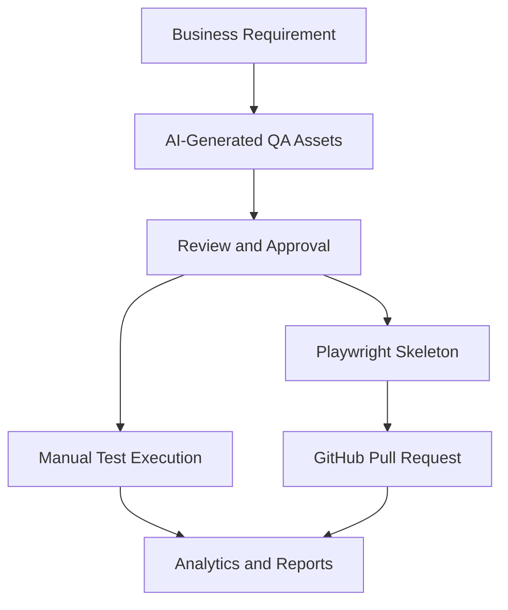

# 02. Executive Summary

## Overview

AI QA Copilot enables QA and engineering teams to transform requirements into governed, executable, and automation-ready QA assets. It combines AI-assisted test design, project organization, review workflows, manual execution, analytics, and GitHub automation repository workflows in one platform.

> **Executive Note**  
> The platform is designed to improve QA productivity while preserving human review, approval, and pull-request governance.

## Executive Problem

Enterprise QA teams often struggle with:

- Slow manual test case creation.
- Inconsistent coverage quality.
- Limited visibility into review and execution readiness.
- Fragmented test assets across tools and spreadsheets.
- Manual automation maintenance after application changes.

## Executive Solution

AI QA Copilot centralizes QA work and uses AI to accelerate the creation, review, execution, and automation readiness of test assets.

## Business Outcomes

| Outcome | How AI QA Copilot Helps |
| --- | --- |
| Faster test design | AI generates structured test cases and acceptance criteria. |
| Better governance | Review workflow locks approved versions. |
| Improved execution visibility | Test runs track pass/fail/blocked/skipped progress. |
| Automation readiness | Playwright output can be pushed to GitHub through PRs. |
| Management reporting | Analytics dashboards summarize coverage, productivity, and review health. |

## Technical Summary

- Frontend: React, TypeScript, Vite, Tailwind, shadcn/Radix UI, Recharts.
- Backend: Express, TypeScript, JWT auth, MongoDB-backed POC store with local JSON fallback.
- AI: Default AI provider plus BYOAI provider routing.
- Integrations: GitHub automation repository integration implemented for MVP.

## Future Scope

Jira, Xray, Azure DevOps, Bitbucket, CI/CD intelligence, and self-healing automation are documented in the roadmap as future capabilities.

## Related Documents

- [Problem Statement](./03-Problem-Statement.md)
- [Solution Overview](./04-Solution-Overview.md)
- [System Architecture](./06-System-Architecture.md)
- [Product Roadmap](./19-Product-Roadmap.md)

## v2 Validation Intelligence Note

AI QA Copilot v2.0 adds validation intelligence across repository workflows: GitHub Actions validation, AI failure analysis, reviewable auto-fix proposals, retry validation, validation history, and release readiness reporting. These capabilities preserve the review-first governance model while helping QA teams make faster, safer release decisions.

## Key Takeaways

### Summary

AI QA Copilot connects requirement analysis, AI-generated QA assets, manual execution, automation readiness, and reporting.

### Benefits

- Accelerates QA planning.
- Improves governance and traceability.
- Gives leaders clearer quality and readiness indicators.

### Future Scope

Future releases can extend enterprise value through ecosystem integrations and release-readiness intelligence.
