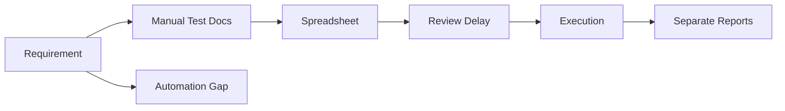

# 03. Problem Statement

## Overview

Modern software delivery requires faster QA cycles without sacrificing coverage, governance, or release confidence. Many QA teams still rely on manual documentation, scattered test assets, and disconnected review processes.

> **Important**  
> The product addresses productivity and governance gaps together. Faster test creation is valuable only when teams can also review, execute, and report on the generated assets.

## Business Problems

| Problem | Impact |
| --- | --- |
| Manual test case creation | Slow test design and inconsistent quality. |
| Coverage gaps | Critical scenarios may be missed before release. |
| Requirement changes | Teams struggle to identify what must be retested. |
| Review bottlenecks | Approved test cases are delayed or undocumented. |
| Fragmented QA assets | Test cases, approvals, executions, and reports live in multiple places. |
| Automation maintenance | Playwright tests can become stale when repositories change. |
| Limited visibility | Managers lack real-time QA progress and quality metrics. |

## Current-State Workflow Challenges

## Stakeholder Impact

- QA engineers spend time writing repetitive scenarios.
- QA leads spend time checking completeness and consistency.
- Engineering managers lack reliable readiness signals.
- Product teams cannot easily see requirement coverage.
- Automation teams receive generic or incomplete Playwright output.

## Solution Direction

AI QA Copilot addresses these problems by creating a connected QA lifecycle platform with AI generation, review, execution, analytics, and GitHub repository workflows.

[Insert Screenshot: Problem Section on Landing Page]

## Related Documents

- [Solution Overview](./04-Solution-Overview.md)
- [Application Workflow and User Guide](./07-Application-Workflow.md)
- [Analytics and Reporting](./14-Analytics-and-Reporting.md)

## Key Takeaways

### Summary

QA teams need faster test design, better coverage, stronger governance, and clearer execution visibility.

### Benefits

- Defines the business case for AI-assisted QA lifecycle management.
- Explains why fragmented tools slow enterprise QA delivery.
- Connects operational pain points to measurable product outcomes.

### Future Scope

Future integrations should reduce tool fragmentation further by connecting issue tracking, CI/CD, and test management ecosystems.
