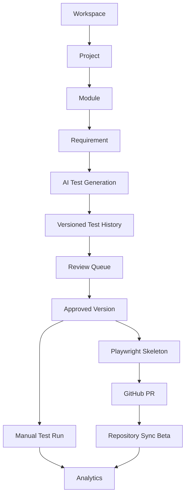

# 04. Solution Overview

## Overview

AI QA Copilot provides a single workspace for managing QA assets across requirements, AI-generated test cases, review approvals, manual execution, reporting, and automation repository workflows.

> **Best Practice**  
> Use projects, modules, and requirements consistently before generating test cases. Good structure improves history, review, analytics, and execution reporting.

## Solution Components

| Component | Description |
| --- | --- |
| Workspace | Organization-level container for projects, members, roles, and settings. |
| Project Management | Organizes QA work by project, module, and requirement. |
| AI Test Generator | Generates test cases, acceptance criteria, test data, coverage analysis, and Playwright skeletons. |
| Test History | Preserves generated versions and status transitions. |
| Review Workflow | Enables submission, approval, rejection, comments, and audit trails. |
| Manual Execution | Creates test runs and tracks execution results with evidence metadata. |
| Analytics | Tracks coverage, productivity, review health, exports, and AI usage. |
| AI Providers | Allows workspace admins to configure provider routing and BYOAI. |
| GitHub Integration | Pushes generated Playwright code to feature branches and pull requests. |
| Repository Sync Beta | Detects repository changes, impacted tests, update suggestions, and PR preview. |

## End-to-End Flow

## Business Value

- Creates repeatable QA governance.
- Reduces manual test design time.
- Improves visibility from requirement to execution.
- Enables safer automation contributions through pull requests.
- Supports enterprise configuration through roles, workspaces, usage limits, and AI provider settings.

## Technical Notes

The backend exposes REST APIs under `/api`. Authentication is JWT-based. Most product APIs are protected by `requireAuth`. MongoDB is used when `MONGODB_URI` is configured.

## Related Documents

- [System Architecture](./06-System-Architecture.md)
- [Core Features](./08-Core-Features.md)
- [Manual Test Execution](./10-Manual-Test-Execution.md)
- [GitHub Integration](./11-GitHub-Integration.md)

## Key Takeaways

### Summary

AI QA Copilot provides an integrated operating model for QA planning, governance, execution, automation readiness, and reporting.

### Benefits

- Reduces context switching.
- Preserves version history and review state.
- Makes QA progress visible to managers and delivery teams.

### Future Scope

Additional integrations can expand the platform from lifecycle management into broader enterprise quality orchestration.
