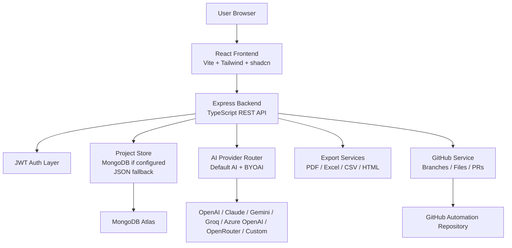
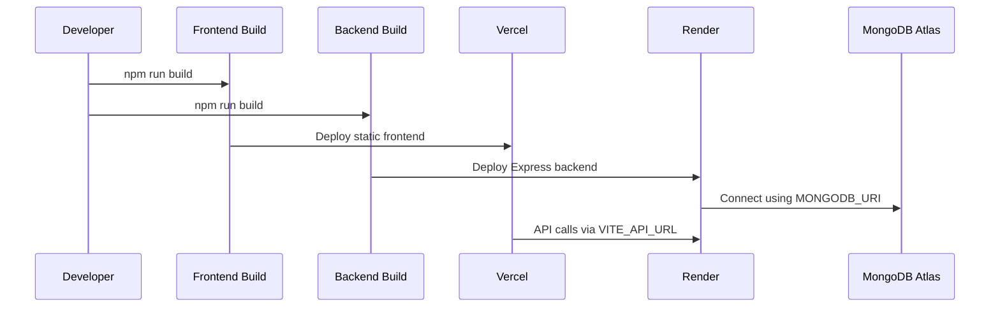

# 06. System Architecture

## Overview

AI QA Copilot uses a React frontend and an Express backend. The backend provides authenticated APIs, AI routing, MongoDB-backed persistence, export services, analytics aggregation, and GitHub integration services.

> **Architecture Note**  
> The current persistence layer is optimized for POC velocity: a consolidated project database document is stored in MongoDB when configured, with a local JSON fallback for development.

## Architecture Diagram

## Frontend Architecture

| Area | Implementation |
| --- | --- |
| Framework | React 19, TypeScript, Vite |
| Styling | Tailwind CSS and shadcn/Radix UI components |
| State | React state in `AppShell.tsx` with service wrappers |
| Charts | Recharts |
| Notifications | Sonner toast notifications |
| Layout | Sidebar, top header, workspace selector, app shell |

Key frontend files:

- `ai-qa-copilot/src/pages/AppShell.tsx`
- `ai-qa-copilot/src/services/projects.ts`
- `ai-qa-copilot/src/components/navigation`
- `ai-qa-copilot/src/components/header`

## Backend Architecture

| Area | Implementation |
| --- | --- |
| Framework | Express with TypeScript |
| Auth | JWT access tokens and bcrypt password hashing |
| Storage | MongoDB-backed POC data store with local JSON fallback |
| AI | Provider router with default and custom providers |
| GitHub | GitHub REST API calls for repo analysis, branches, files, and PRs |
| Export | Excel/PDF/CSV/HTML-style report responses |

Key backend files:

- `ai-qa-backend/src/server.ts`
- `ai-qa-backend/src/projectStore.ts`
- `ai-qa-backend/src/projectRoutes.ts`
- `ai-qa-backend/src/testExecutionRoutes.ts`
- `ai-qa-backend/src/integrationRoutes.ts`
- `ai-qa-backend/src/github.service.ts`
- `ai-qa-backend/src/aiProviderRouter.ts`

## Database Model Approach

The current POC uses a consolidated project database document persisted through `projectStore.ts`. MongoDB is used when `MONGODB_URI` is configured.

Major logical collections inside the store:

- Users
- Workspaces
- Workspace members
- Projects
- Modules
- Requirements
- Test case histories
- Review comments
- Test runs
- Test executions
- AI chats
- AI provider configs
- GitHub automation configs
- Repository analyses
- Repository syncs
- Subscriptions, trials, usage, plans

## Deployment Flow

## Enterprise Use Case

An enterprise QA team can deploy the frontend and backend independently, connect the backend to MongoDB Atlas, configure organization-approved AI providers, and restrict repository automation through GitHub pull requests.

## Related Documents

- [Deployment Guide](./18-Deployment-Guide.md)
- [Security](./16-Security.md)
- [API Documentation](./17-API-Documentation.md)

## v2 Validation Intelligence Note

AI QA Copilot v2.0 adds validation intelligence across repository workflows: GitHub Actions validation, AI failure analysis, reviewable auto-fix proposals, retry validation, validation history, and release readiness reporting. These capabilities preserve the review-first governance model while helping QA teams make faster, safer release decisions.

## Key Takeaways

### Summary

The architecture separates user experience, API orchestration, persistence, AI provider routing, exports, and GitHub automation services.

### Benefits

- Supports independent frontend/backend deployment.
- Keeps AI provider and GitHub secrets server-side.
- Allows MongoDB-backed persistence for hosted environments.

### Future Scope

For high-scale production, the consolidated POC store can evolve into normalized MongoDB collections with indexes and dedicated repositories.
