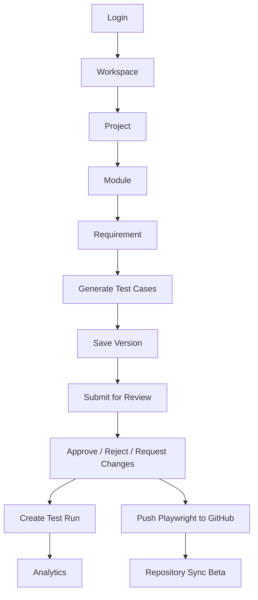

# 07. Application Workflow and User Guide

## Overview

This chapter describes the implemented user workflow from login to analytics and GitHub automation actions.

> **Best Practice**  
> For the cleanest demo, create the workflow in this order: workspace, project, module, requirement, AI generation, history save, review approval, manual execution, and GitHub PR.

## Main Workflow

## User Guide

### 1. Login

1. Open the application.
2. Login with an email and password.
3. The frontend stores the access token and calls `/api/auth/me`.

[Insert Screenshot: Login Page]

### 2. Create or Select Workspace

1. Open **Team Workspace**.
2. Create a workspace or select an existing workspace.
3. Invite members and assign roles.

### 3. Create Project

1. Open **Projects**.
2. Click **Create Project**.
3. Enter project name, description, domain, and status.
4. Save the project.

### 4. Add Module and Requirement

1. Open a project detail view.
2. Add module information such as Login, Registration, Payment, or Dashboard.
3. Add requirement title, description, acceptance criteria, priority, and status.

### 5. Generate Test Cases

1. Open **Test Generator**.
2. Select project, module, and requirement.
3. Enter or refine requirement text.
4. Generate test plan.
5. Review positive, negative, edge, data, acceptance criteria, coverage, and Playwright tabs.

[Insert Screenshot: Generated Test Plan]

### 6. Review Test Cases

1. Save generated output as a test history version.
2. Submit the version for review.
3. QA Lead/Admin reviews in **Review Queue**.
4. Approve, reject, or request changes.

### 7. Execute Manual Tests

1. Open **Test Execution**.
2. Create a test run from approved test case versions.
3. Update each execution status.
4. Add actual result, comments, evidence links, browser, OS, build, environment, and Jira bug references where required.
5. Export execution reports.

### 8. Connect GitHub

1. Open **Settings → Integrations**.
2. Configure GitHub token, owner, repository, branch, and test folder path.
3. Test connection.
4. Analyze repository.

### 9. Push Playwright Tests

1. Open generated test plan.
2. Select Playwright tab.
3. Click **Push to GitHub**.
4. Confirm filename and create pull request.

### 10. Sync Repository

1. Open **Settings → Integrations → Repository Sync Beta**.
2. Click **Sync Repository**.
3. Generate suggestions.
4. Generate updates.
5. Review PR preview.
6. Confirm and create PR.

### 11. View Analytics

1. Open **Analytics**.
2. Filter by workspace, project, module, user, date, and status.
3. Review coverage, generation, review, productivity, AI usage, and export metrics.

### 12. Configure AI Providers

1. Open **Settings → AI Providers**.
2. Add provider details.
3. Test and activate provider.
4. Configure feature-level model mapping.

## Screenshot Placeholders

[Insert Screenshot: Login Page]

[Insert Screenshot: Project Creation Modal]

[Insert Screenshot: AI Test Generator]

[Insert Screenshot: Review Queue]

[Insert Screenshot: Repository Sync PR Preview]

## Related Documents

- [Core Features](./08-Core-Features.md)
- [AI Features](./09-AI-Features.md)
- [Manual Test Execution](./10-Manual-Test-Execution.md)
- [GitHub Integration](./11-GitHub-Integration.md)

## Key Takeaways

### Summary

The application workflow supports the full QA journey from authenticated workspace access through analytics and automation repository review.

### Benefits

- Gives QA teams a repeatable operating model.
- Makes generated test assets governable and executable.
- Connects automation workflows to pull-request review.

### Future Scope

Future workflow enhancements should add integrations for issue tracking, CI/CD status, and release-readiness gates.
