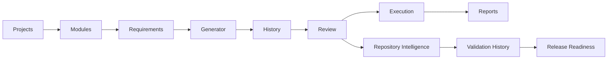

# 08. Core Features

## Overview

Core features provide the foundation for managing QA assets, teams, workflows, and outcomes.

> **Note**  
> Core features are implemented in the current application. Integration items such as Jira or Bitbucket are documented only as roadmap where not present in code.

## Feature Matrix

| Feature | Description | Business Value |
| --- | --- | --- |
| Dashboard | Workspace KPIs, recent projects, usage, trial cards. | Management visibility. |
| Projects | Create and manage project metadata. | Organize QA work. |
| Modules | Group requirements by functional area. | Improve traceability. |
| Requirements | Capture requirement details and acceptance criteria. | Link business intent to QA assets. |
| Test Generator | Generate QA artifacts using AI. | Reduce manual authoring. |
| Test History | Store versions of generated output. | Preserve auditability. |
| Review Queue | Approve, reject, and request changes. | Governance and quality control. |
| Manual Execution | Execute approved test cases. | Track real QA outcomes. |
| Analytics | Charts and tables for quality metrics. | Improve decision-making. |
| Workspace | Team, roles, invites, activity logs. | Enterprise collaboration. |
| Billing | Plans, trial, usage quotas. | SaaS readiness. |
| Settings | Profile, AI providers, integrations. | Enterprise configurability. |
| Repository Intelligence | Application repositories, automation repositories, activity, impact analysis, validation history, and release readiness. | Connect code changes to QA decisions. |
| AI Failure Analysis | Explain failed validation runs with root cause, category, confidence, and recommended fix. | Shorten triage time after failed automation validation. |
| AI Auto Fix | Generate reviewable Playwright fix proposals from failed validation data. | Accelerate remediation while keeping human approval in control. |
| Retry Validation | Re-run approved fixes through GitHub Actions validation attempts. | Confirm fixes before pull request creation. |
| Release Readiness | Summarize validation outcomes, risks, pending fixes, and release recommendation. | Give leaders a clear release decision signal. |

## Core Workflow

## Screenshot Placeholders

[Insert Screenshot: Projects Page]

[Insert Screenshot: Project Detail Page]

[Insert Screenshot: Review Queue]

## Technical Notes

- Frontend service APIs are centralized in `src/services/projects.ts`.
- Backend routes are grouped by domain in route files such as `projectRoutes.ts`, `reviewRoutes.ts`, and `testExecutionRoutes.ts`.
- Most APIs require a JWT bearer token.

## Future Scope

- Richer requirement import sources.
- Bulk editing for modules and requirements.
- Enhanced approval assignment and notification workflows.

## Related Documents

- [Application Workflow and User Guide](./07-Application-Workflow.md)
- [API Documentation](./17-API-Documentation.md)
- [Enterprise Features](./15-Enterprise-Features.md)

## v2 Validation Intelligence Note

AI QA Copilot v2.0 adds validation intelligence across repository workflows: GitHub Actions validation, AI failure analysis, reviewable auto-fix proposals, retry validation, validation history, and release readiness reporting. These capabilities preserve the review-first governance model while helping QA teams make faster, safer release decisions.

## Key Takeaways

### Summary

Core features organize QA work into workspaces, projects, modules, requirements, histories, reviews, executions, and reports.

### Benefits

- Creates structure across QA artifacts.
- Improves traceability from requirement to outcome.
- Gives teams a foundation for automation and analytics.

### Future Scope

Future improvements can focus on bulk operations, richer import/export, and more granular workflow assignment.
