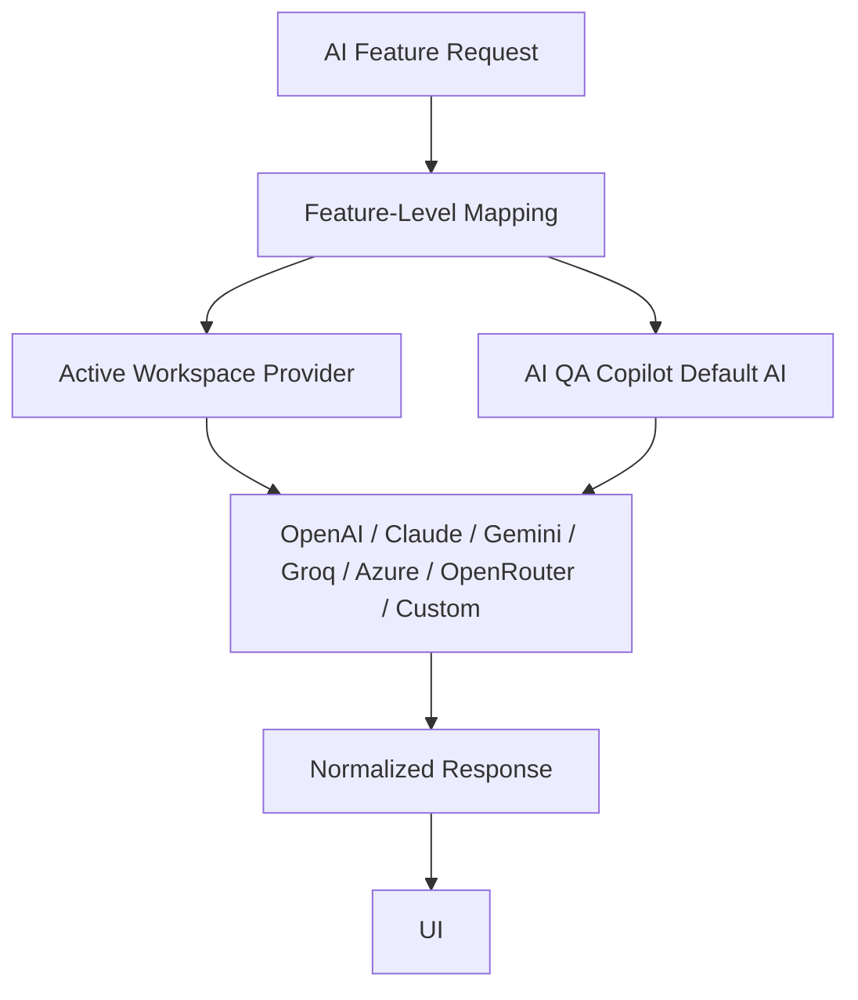

# 09. AI Features

## Overview

AI QA Copilot includes AI-assisted test generation, AI chat, requirement impact analysis, Playwright skeleton generation, coverage scoring, and BYOAI provider routing.

> **Important**  
> AI-generated content is intended to assist QA teams. Official test versions should still move through review and approval before execution or final export.

## Implemented AI Capabilities

| Capability | Description |
| --- | --- |
| Test case generation | Positive, negative, edge, API/UI/regression-style scenarios. |
| Test data suggestions | Data types, examples, and descriptions. |
| Acceptance criteria | Structured acceptance criteria from requirement text. |
| Coverage score | Coverage score and recommendations. |
| Playwright skeleton | Automation-ready Playwright test skeleton. |
| AI chat | Context-aware chat using project/module/requirement/history. |
| Save as new version | AI chat output can be saved as a new history version. |
| Requirement impact analysis | Regression impact analysis for requirement changes. |
| AI providers | Default AI or workspace-configured provider. |

## AI Provider Router

## BYOAI Provider Support

Implemented provider types include:

- OpenAI
- Anthropic Claude
- Google Gemini
- Groq
- Azure OpenAI
- OpenRouter
- Custom OpenAI-compatible API

## Business Value

- Reduces QA authoring effort.
- Standardizes generated output.
- Supports enterprise AI policy flexibility.
- Enables model choice per feature.

## Technical Notes

- Provider config is managed through `/api/ai-providers`.
- API keys are encrypted before storage.
- Usage logs are captured with provider, feature, status, and optional token usage.
- Default AI continues to work if no custom provider is active.

[Insert Screenshot: AI Providers Settings]

[Insert Screenshot: AI Chat with Requirement Context]

[Insert Screenshot: Playwright Skeleton Output]

## Related Documents

- [Review and Core Features](./08-Core-Features.md)
- [GitHub Integration](./11-GitHub-Integration.md)
- [Security](./16-Security.md)

## v2 Validation Intelligence Note

AI QA Copilot v2.0 adds validation intelligence across repository workflows: GitHub Actions validation, AI failure analysis, reviewable auto-fix proposals, retry validation, validation history, and release readiness reporting. These capabilities preserve the review-first governance model while helping QA teams make faster, safer release decisions.

## Key Takeaways

### Summary

AI capabilities accelerate test design, chat-based QA analysis, coverage scoring, impact analysis, and Playwright skeleton generation.

### Benefits

- Reduces repetitive writing.
- Improves scenario completeness.
- Gives enterprises control through AI provider flexibility.

### Future Scope

Future AI enhancements can include bug analysis, release readiness, root cause analysis, and self-healing automation suggestions.
