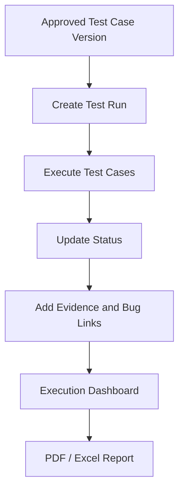

# 10. Manual Test Execution

## Overview

Manual Test Execution Management allows QA teams to create test runs from approved test case versions and record execution outcomes.

> **Important**  
> Test runs should be created from approved test case versions. This keeps execution aligned with reviewed and governed QA assets.

## Execution Statuses

- Not Executed
- Passed
- Failed
- Blocked
- Skipped

## Evidence Fields

| Field | Purpose |
| --- | --- |
| Screenshot URL | Visual evidence for failures. |
| Video URL | Session evidence. |
| Log URL | Diagnostic evidence. |
| Jira Bug ID / URL | Defect traceability. |
| Execution Time | Time spent executing the case. |
| Browser | Chrome, Firefox, Safari, Edge. |
| Operating System | Windows, macOS, Linux, Android, iOS. |
| Build Number | Build under test. |
| Environment | QA, UAT, Staging, Production. |
| Actual Result | Observed result. |
| Comments | Notes, blocker reason, or defect detail. |

## Validation Rules

| Status | Required Fields |
| --- | --- |
| Failed | Actual result, comments, and screenshot/log/Jira evidence. |
| Blocked | Comments or blocker reason. |

## Workflow

## Reports

Execution reports include:

- Test run summary.
- Pass/fail/blocked/skipped/not executed counts.
- Pass rate.
- Execution details.
- Evidence links.
- Jira bug references.
- Browser, OS, build, environment, execution time.

## Technical Notes

Backend routes:

- `POST /api/test-runs`
- `GET /api/test-runs`
- `GET /api/test-runs/:id`
- `PATCH /api/test-executions/:id/status`
- `PATCH /api/test-executions/:id/details`
- `POST /api/test-executions/:id/attachments`
- `DELETE /api/test-executions/:id/attachments/:attachmentId`
- `GET /api/test-execution/dashboard`

[Insert Screenshot: Test Execution Detail Page]

[Insert Screenshot: Execution Evidence Section]

[Insert Screenshot: Execution Dashboard]

## Related Documents

- [Review Workflow in Core Features](./08-Core-Features.md)
- [Analytics and Reporting](./14-Analytics-and-Reporting.md)
- [API Documentation](./17-API-Documentation.md)

## Key Takeaways

### Summary

Manual Test Execution tracks test run progress, execution results, evidence metadata, bug links, and execution reporting.

### Benefits

- Improves execution accountability.
- Links failures to evidence and defects.
- Feeds execution metrics into analytics.

### Future Scope

Production-grade file storage, virus scanning, and direct defect-tool integration should be considered for enterprise deployments.
