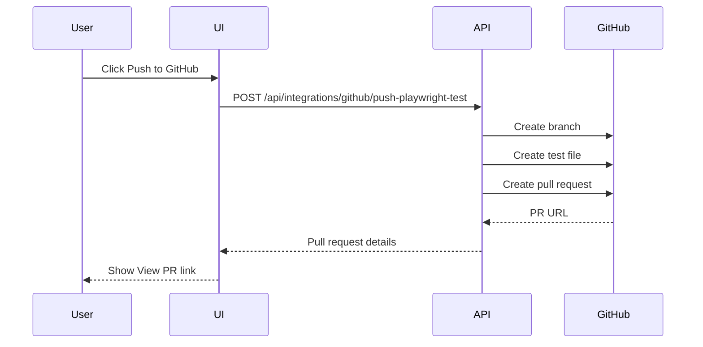

# 11. GitHub Integration

## Overview

GitHub Automation Repository Integration lets users connect a GitHub automation repository and create pull requests for generated Playwright tests.

> **Best Practice**  
> Always review generated Playwright code in a pull request before merging it into the automation repository.

## Implemented Scope

| Capability | Status |
| --- | --- |
| GitHub repository config | Implemented |
| Personal access token connection | Implemented |
| Test connection | Implemented |
| Create feature branch | Implemented |
| Create or update file on feature branch | Implemented |
| Create pull request | Implemented |
| Direct push to main | Not allowed |
| Bitbucket | Future Roadmap |

## Configuration Fields

- GitHub token
- Repository owner
- Repository name
- Default branch
- Test folder path

## Push to GitHub Flow

## Business Value

- Prevents unreviewed automation changes.
- Routes generated code through engineering review.
- Preserves team Git workflows.
- Avoids direct writes to the default branch.

## Technical Notes

- GitHub tokens are encrypted in backend storage.
- Token values are masked in the UI.
- The integration is configured in **Settings → Integrations**.
- Branch names use `aiqa/{requirement-slug}-{timestamp}-{random}`.

[Insert Screenshot: GitHub Integration Settings]

[Insert Screenshot: Push to GitHub Dialog]

[Insert Screenshot: Created Pull Request Link]

## Related Documents

- [Smart Repository Analysis](./12-Smart-Repository-Analysis.md)
- [AI Repository Sync Beta](./13-AI-Repository-Sync.md)
- [Security](./16-Security.md)

## Key Takeaways

### Summary

GitHub integration safely routes generated Playwright code into feature branches and pull requests.

### Benefits

- Preserves code review discipline.
- Prevents direct writes to protected branches.
- Bridges QA test design and automation engineering workflows.

### Future Scope

Bitbucket support is a future roadmap item and should follow the same branch-and-pull-request safety model.
