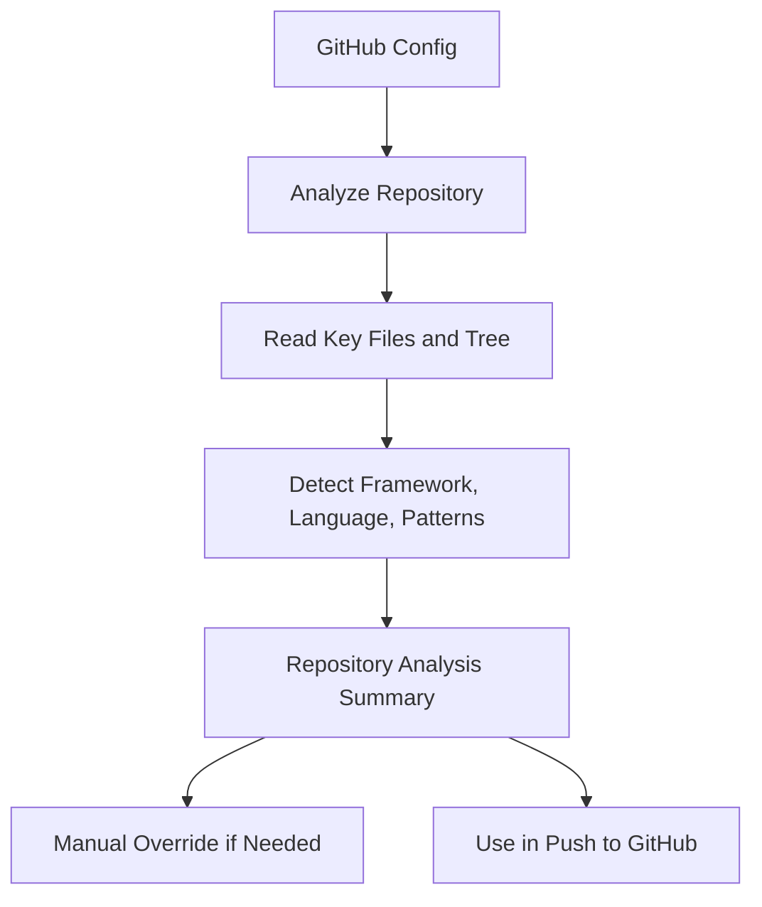

# 12. Smart Repository Analysis

## Overview

Smart Repository Analysis scans a connected GitHub automation repository to detect its Playwright framework, language, folder structure, and project conventions before generating or pushing tests.

> **Note**  
> Smart Repository Analysis is implemented for GitHub in the current MVP. Bitbucket repository intelligence is a future roadmap extension.

## Files and Folders Analyzed

| Type | Examples |
| --- | --- |
| Config files | `package.json`, `playwright.config.ts`, `playwright.config.js`, `tsconfig.json` |
| Java build files | `pom.xml`, `build.gradle` |
| Documentation | `README.md` |
| Test folders | `tests/`, `e2e/`, `specs/`, `src/test/`, `playwright/`, `automation/` |

## Detection Output

- Framework
- Language
- Build tool
- Test folder path
- Page object folder path
- Page Object Model usage
- Fixture usage
- Naming convention
- Import style
- Confidence score
- Scanned files

## Analysis Flow

## Business Value

Smart Repository Analysis helps automation teams avoid generic generated code by adapting generated Playwright output to the existing repository setup.

## Technical Notes

Backend routes:

- `POST /api/integrations/github/analyze-repository`
- `GET /api/integrations/github/analysis`
- `PUT /api/integrations/github/analysis/override`

[Insert Screenshot: Detected Repository Setup]

[Insert Screenshot: Repository Analysis Manual Override]

## Related Documents

- [GitHub Integration](./11-GitHub-Integration.md)
- [AI Repository Sync Beta](./13-AI-Repository-Sync.md)
- [System Architecture](./06-System-Architecture.md)

## v2 Validation Intelligence Note

AI QA Copilot v2.0 adds validation intelligence across repository workflows: GitHub Actions validation, AI failure analysis, reviewable auto-fix proposals, retry validation, validation history, and release readiness reporting. These capabilities preserve the review-first governance model while helping QA teams make faster, safer release decisions.

## Key Takeaways

### Summary

Smart Repository Analysis detects repository setup and automation conventions so generated Playwright work is better aligned with the target repository.

### Benefits

- Reduces generic generated code.
- Improves reviewability for automation teams.
- Helps select the right folder and style for PR output.

### Future Scope

Future versions can deepen code-style analysis and support additional repository providers such as Bitbucket and Azure DevOps.
