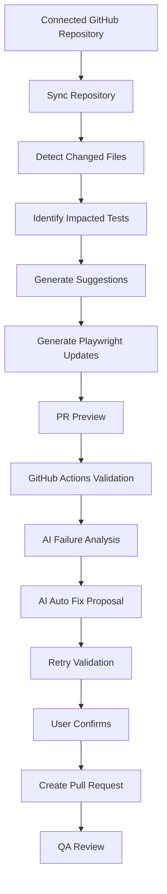

# 13. AI Repository Sync Beta

## Overview

AI Repository Sync Beta detects GitHub repository changes, identifies impacted Playwright tests, generates recommendations, creates PR previews, and can open pull requests for AI-assisted Playwright updates.

> **Beta Notice**  
> Repository Sync is intentionally review-first. It generates suggestions and PR previews, but it does not auto-merge or push directly to the default branch.

## Beta Scope

| Capability | Status |
| --- | --- |
| GitHub sync | Implemented |
| Changed file detection | Implemented |
| Impacted test detection | Implemented |
| AI-style suggestions | Implemented |
| Generated update preview | Implemented |
| Create update PR | Implemented |
| Auto-merge | Not supported |
| Bitbucket sync | Future Roadmap |

## Workflow

## v2 Validation Intelligence

The repository sync workflow now includes a validation intelligence layer after Playwright updates are generated and approved.

| Capability | Description | Business Value |
| --- | --- | --- |
| GitHub Actions Validation | Runs approved updates through the connected automation repository workflow. | Validates inside the real automation project context. |
| AI Failure Analysis | Explains failed validation runs using logs, stack traces, impacted tests, and changed files. | Helps QA teams triage failures faster. |
| AI Auto Fix | Generates reviewable fixed Playwright code when an issue is likely fixable. | Speeds remediation without automatically changing repository code. |
| Retry Validation | Records user-triggered validation retry attempts. | Confirms fixes before a pull request is created. |
| Validation History | Centralizes validation attempts across repositories and projects. | Provides traceability for QA and automation decisions. |
| Release Readiness | Calculates a readiness score and recommendation from validation, risk, coverage, and manual execution signals. | Gives QA leads and managers a release decision view. |

## PR Preview Includes

- Files to add.
- Files to update.
- Old code preview.
- New AI-suggested code preview.
- Impact reason.
- Confidence score.
- Risk level.
- Branch name.
- PR title and description.

## Safety Rules

- No direct push to main.
- No auto-merge.
- No update without user confirmation.
- No AI auto-fix is applied until a user approves it.
- Retry validation is user-triggered and limited.
- Low confidence updates are marked for manual review.
- If no impacted tests or changed files are found, update PR creation is blocked.

## Technical Notes

Backend routes:

- `POST /api/integrations/github/sync`
- `GET /api/integrations/github/sync-history`
- `GET /api/integrations/github/sync/:syncId`
- `POST /api/integrations/github/sync/:syncId/generate-suggestions`
- `POST /api/integrations/github/sync/:syncId/generate-updates`
- `GET /api/integrations/github/sync/:syncId/pr-preview`
- `POST /api/integrations/github/sync/:syncId/create-update-pr`
- `POST /api/integrations/github/sync/:syncId/create-pr`
- `POST /api/validation/:validationRunId/failure-analysis`
- `POST /api/validation/:validationRunId/auto-fix`
- `POST /api/validation/:validationRunId/retry`
- `GET /api/validation/history`
- `GET /api/release-readiness/summary`

[Insert Screenshot: Repository Sync Beta]

[Insert Screenshot: Repository Sync PR Preview]

[Insert Screenshot: Generated Update Diff Preview]

## Related Documents

- [GitHub Integration](./11-GitHub-Integration.md)
- [Smart Repository Analysis](./12-Smart-Repository-Analysis.md)
- [Analytics and Reporting](./14-Analytics-and-Reporting.md)

## Key Takeaways

### Summary

AI Repository Sync Beta helps teams detect application changes, identify impacted Playwright tests, generate update previews, and create reviewable PRs.

### Benefits

- Reduces manual automation maintenance effort.
- Improves regression test reliability.
- Keeps automation updates inside pull-request governance.

### Future Scope

Future improvements may include richer code diffing, CI/CD feedback, flaky-test detection, and self-healing recommendations.
