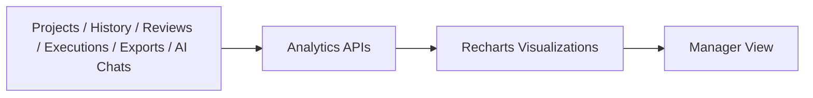

# 14. Analytics and Reporting

## Overview

Analytics provides workspace and project-level visibility across coverage, generation, review, productivity, AI usage, exports, and manual execution.

> **Best Practice**  
> Use analytics after each review and execution cycle to identify low coverage, review bottlenecks, and execution risk before release decisions.

## Analytics Areas

| Area | Metrics |
| --- | --- |
| Summary | Projects, modules, requirements, test cases, coverage, reviews, exports, AI chat. |
| Coverage | Average coverage, trends, low coverage requirements. |
| Generation | Generated test cases by date, project, module, user, and type. |
| Review | Draft, submitted, approved, rejected, changes requested, approval time. |
| Project Health | Requirements, versions, coverage, pending reviews, health status. |
| User Productivity | Test cases, reviews, approvals, chats, exports, last active. |
| AI Usage | Generations, chat messages, quick prompts, saved AI versions. |
| Export Analytics | Excel/PDF export counts by project/user/status. |
| Execution | Pass rate, failures, evidence, bugs, browser/OS failures, build pass rate. |

## Dashboard Flow

## Reporting

Implemented exports include:

- Test case history exports.
- Project/requirement/version exports.
- Execution reports.
- Export history tracking.

## Business Value

- Enables management-ready reporting.
- Helps identify coverage gaps.
- Highlights review bottlenecks.
- Shows productivity and AI usage trends.
- Supports release readiness discussions.

[Insert Screenshot: Analytics Dashboard]

[Insert Screenshot: Coverage Trend Chart]

[Insert Screenshot: Execution Analytics Cards]

## Related Documents

- [Manual Test Execution](./10-Manual-Test-Execution.md)
- [AI Features](./09-AI-Features.md)
- [Executive Summary](./02-Executive-Summary.md)

## Key Takeaways

### Summary

Analytics converts project, review, generation, execution, AI, and export data into management-ready insights.

### Benefits

- Makes quality status visible.
- Highlights coverage and review risks.
- Supports data-driven release conversations.

### Future Scope

Future reporting can add release-readiness scoring, trend benchmarking, and scheduled executive reports.
