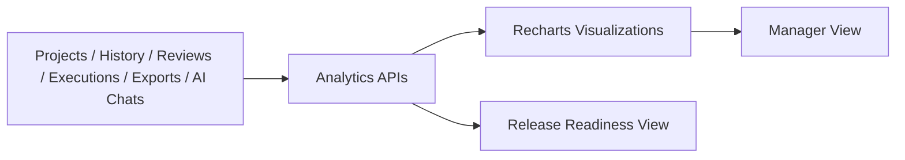

# 14. Analytics and Reporting

## Overview

Analytics provides workspace and project-level visibility across coverage, generation, review, productivity, AI usage, exports, and manual execution.

> **Best Practice**  
> Use analytics after each review and execution cycle to identify low coverage, review bottlenecks, and execution risk before release decisions.

## Analytics Areas

| Area | Metrics |
| --- | --- |
| Summary | Projects, modules, requirements, test cases, coverage, reviews, exports, AI chat. |
| Coverage | Average coverage, trends, low coverage requirements. |
| Generation | Generated test cases by date, project, module, user, and type. |
| Review | Draft, submitted, approved, rejected, changes requested, approval time. |
| Project Health | Requirements, versions, coverage, pending reviews, health status. |
| User Productivity | Test cases, reviews, approvals, chats, exports, last active. |
| AI Usage | Generations, chat messages, quick prompts, saved AI versions. |
| Export Analytics | Excel/PDF export counts by project/user/status. |
| Execution | Pass rate, failures, evidence, bugs, browser/OS failures, build pass rate. |
| Validation Intelligence | Validation pass rate, failed validations, retry attempts, pending auto-fixes, AI recommendations. |
| Release Readiness | Readiness score, recommendation, high-risk changes, pending fixes, and release risk summary. |

## Dashboard Flow

## Reporting

Implemented exports include:

- Test case history exports.
- Project/requirement/version exports.
- Execution reports.
- Export history tracking.

## Business Value

- Enables management-ready reporting.
- Helps identify coverage gaps.
- Highlights review bottlenecks.
- Shows productivity and AI usage trends.
- Supports release readiness discussions.
- Connects automation validation outcomes to management-level release decisions.

## v2 Validation and Release Readiness Analytics

AI QA Copilot v2.0 adds validation intelligence analytics for teams using repository-driven Playwright workflows.

| Metric | Description | Audience |
| --- | --- | --- |
| Validation pass rate | Ratio of passed validations to total validation attempts. | QA leads, engineering managers |
| Failed validations | Validation runs that require triage or fix proposals. | QA engineers, automation engineers |
| Pending AI fixes | Auto-fix proposals waiting for approval, editing, or rejection. | QA leads |
| Retry attempts | User-triggered validation retries after fixes are approved. | QA engineers |
| Release readiness score | Composite score based on validation results, risks, pending fixes, coverage, and manual execution data. | QA managers, delivery managers |
| Release recommendation | Ready, proceed with caution, or not recommended. | Management and release stakeholders |

[Insert Screenshot: Analytics Dashboard]

[Insert Screenshot: Coverage Trend Chart]

[Insert Screenshot: Execution Analytics Cards]

[Insert Screenshot: Validation History]

[Insert Screenshot: Release Readiness Dashboard]

## Related Documents

- [Manual Test Execution](./10-Manual-Test-Execution.md)
- [AI Features](./09-AI-Features.md)
- [Executive Summary](./02-Executive-Summary.md)

## v2 Validation Intelligence Note

AI QA Copilot v2.0 adds validation intelligence across repository workflows: GitHub Actions validation, AI failure analysis, reviewable auto-fix proposals, retry validation, validation history, and release readiness reporting. These capabilities preserve the review-first governance model while helping QA teams make faster, safer release decisions.

## Key Takeaways

### Summary

Analytics converts project, review, generation, execution, AI, and export data into management-ready insights.

### Benefits

- Makes quality status visible.
- Highlights coverage and review risks.
- Supports data-driven release conversations.

### Future Scope

Future reporting can add trend benchmarking, scheduled executive reports, and deeper release-train configuration.
