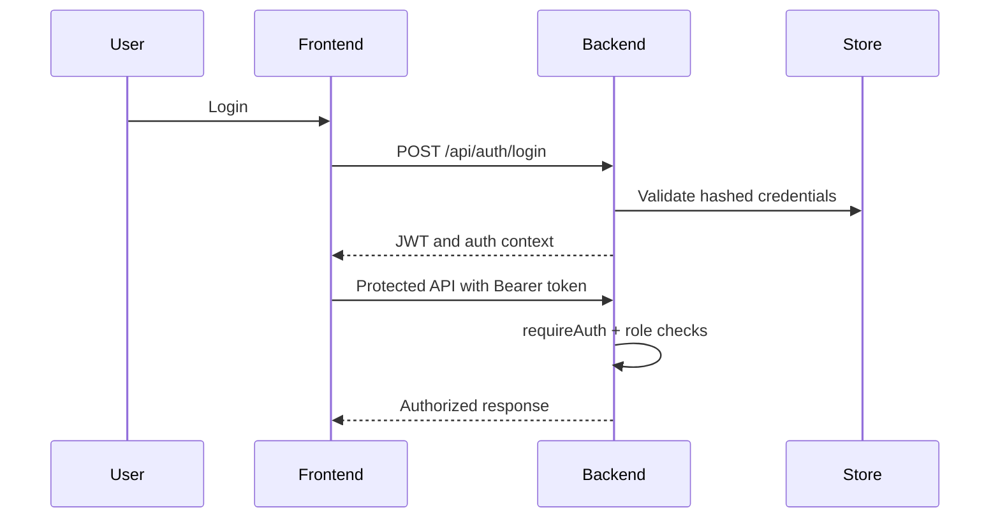

# 16. Security

## Overview

Security is implemented through JWT authentication, password hashing, protected routes, encrypted secrets, role checks, and safe GitHub workflows.

> **Important**  
> Any API keys, GitHub tokens, MongoDB URIs, or AI provider credentials shared during development should be rotated before production use.

## Authentication

| Area | Implementation |
| --- | --- |
| Signup/Login | Email and password. |
| Password storage | Hashed using bcrypt/scrypt-compatible project logic. |
| API auth | JWT bearer token. |
| Protected APIs | `/api` product routes use `requireAuth` after auth router. |
| Rate limiting | Auth endpoints have basic rate limiting. |

## Secret Handling

- AI provider API keys are encrypted before storage.
- GitHub tokens are encrypted before storage.
- Tokens and keys are masked in UI responses.
- `.env` is ignored and must not be committed.
- MongoDB URI must be provided as an environment variable.

## Authorization

Workspace APIs use role and workspace checks. Key controls include:

- `requireAuth`
- `requireWorkspaceAccess`
- `requireWorkspaceRole`
- `requireProjectAccess`

## GitHub Safety

- No direct push to default branch.
- Feature branches are created for generated Playwright files.
- Pull requests are created for review.
- Repository Sync Beta requires user confirmation before update PR creation.

## Attachment Safety

Manual execution attachment APIs validate type metadata and block executable upload names. The current POC stores evidence links/metadata, not a production file storage service.

## Production Recommendations

- Rotate all leaked or shared credentials.
- Use a dedicated secret manager in production.
- Configure secure cookies or hardened token storage as needed.
- Use server-side file storage with virus scanning for attachments.
- Add audit log exports for regulated environments.

## Security Flow

## Related Documents

- [API Documentation](./17-API-Documentation.md)
- [Deployment Guide](./18-Deployment-Guide.md)
- [Enterprise Features](./15-Enterprise-Features.md)

## Key Takeaways

### Summary

The platform uses JWT authentication, encrypted provider secrets, role checks, and PR-based repository safety.

### Benefits

- Protects sensitive configuration.
- Supports role-based enterprise usage.
- Reduces automation repository risk.

### Future Scope

Recommended production improvements include SSO, SCIM, audit exports, hardened token storage, and production-grade attachment storage.
