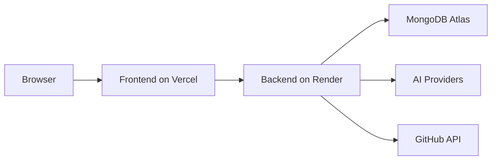

# 18. Deployment Guide

## Overview

AI QA Copilot can be deployed with the frontend on Vercel and the backend on Render. MongoDB Atlas is used for persistent data when `MONGODB_URI` is configured.

> **Best Practice**  
> Configure production secrets in the hosting provider dashboard. Do not commit `.env` files or real credentials.

## Local Development

Backend:

```bash
cd ai-qa-backend
npm install
npm run dev
```

Frontend:

```bash
cd ai-qa-copilot
npm install
npm run dev
```

## Build Commands

Backend:

```bash
npm run build
```

Frontend:

```bash
npm run build
```

## Backend Environment Variables

| Variable | Required | Description |
| --- | --- | --- |
| `PORT` | Yes | Backend port. |
| `CORS_ORIGIN` | Yes | Allowed frontend origins. |
| `JWT_SECRET` | Recommended | JWT signing secret. |
| `MONGODB_URI` | Recommended | MongoDB Atlas connection URI. |
| `MONGODB_DB_NAME` | Recommended | Database name, currently `ai-qa-copilot`. |
| `GROQ_API_KEY` | Optional | Default AI provider key. |
| `GROQ_MODEL` | Optional | Default AI model. |
| `RESEND_API_KEY` | Optional | Email sender key. |
| `EMAIL_FROM` | Optional | Email sender address. |
| `FRONTEND_APP_URL` | Yes | Frontend URL for links. |
| `AI_PROVIDER_ENCRYPTION_KEY` | Recommended | Encryption key for provider/GitHub secrets. |

## Frontend Environment Variables

| Variable | Required | Description |
| --- | --- | --- |
| `VITE_API_URL` | Yes | Backend API base URL. |

Example:

```env
VITE_API_URL=https://ai-qa-backend.onrender.com
```

## Render Backend Deployment

1. Connect backend repository.
2. Set build command: `npm install && npm run build`.
3. Set start command: `npm start`.
4. Add environment variables.
5. Configure CORS to include frontend domain.
6. Verify `/health`.

## Vercel Frontend Deployment

1. Connect frontend repository.
2. Set framework as Vite.
3. Add `VITE_API_URL`.
4. Deploy.
5. Verify login and dashboard API calls.

## MongoDB Atlas

1. Create Atlas cluster.
2. Create database user.
3. Allow Render outbound IPs or allow appropriate network access.
4. Set `MONGODB_URI`.
5. Set `MONGODB_DB_NAME=ai-qa-copilot`.

## Deployment Diagram



## Production Checklist

- Rotate demo credentials.
- Use strong `JWT_SECRET` and encryption key.
- Configure CORS strictly.
- Confirm MongoDB database name.
- Verify password reset and invite email sender.
- Verify GitHub token permissions.
- Run frontend and backend builds before deployment.

## Related Documents

- [System Architecture](./06-System-Architecture.md)
- [Security](./16-Security.md)
- [API Documentation](./17-API-Documentation.md)

## Key Takeaways

### Summary

The recommended deployment model is Vercel for frontend, Render for backend, and MongoDB Atlas for persistence.

### Benefits

- Separates frontend and backend release cycles.
- Keeps backend secrets server-side.
- Supports hosted MongoDB persistence with local fallback for development.

### Future Scope

Future deployment documentation can include Docker, Kubernetes, custom domains, monitoring, alerts, and backup/restore procedures.
