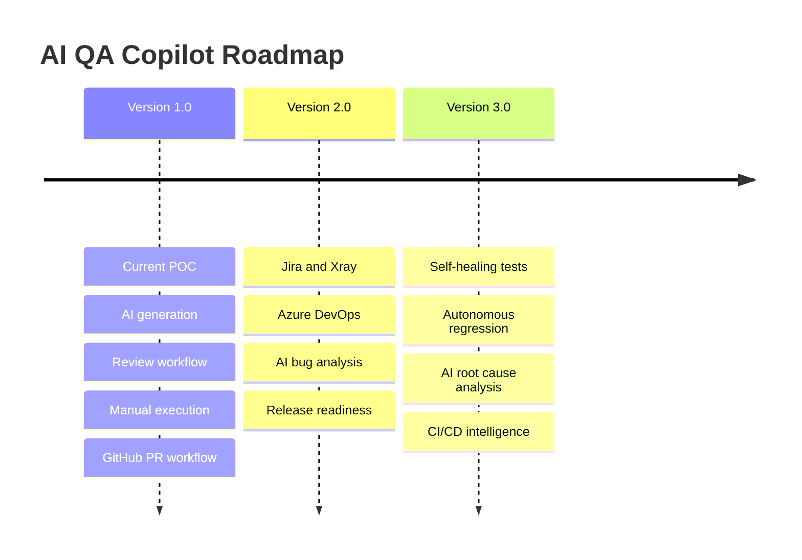

# 19. Product Roadmap

## Overview

This roadmap separates current implemented capabilities from future product direction.

> **Roadmap Notice**  
> Roadmap items are directional and should not be presented as currently available unless they are implemented in the product.

## Version 1.0 - Current Implemented POC

| Area | Status |
| --- | --- |
| AI Test Case Generation | Implemented |
| Project/Module/Requirement Management | Implemented |
| Test Case History | Implemented |
| Review and Approval Workflow | Implemented |
| Manual Test Execution | Implemented |
| Evidence Metadata and Execution Reporting | Implemented |
| Analytics Dashboard | Implemented |
| Team Workspace and Roles | Implemented |
| Pricing, Trial, Usage Quotas | Implemented |
| AI Providers / BYOAI | Implemented |
| GitHub Automation Repository Integration | Implemented |
| Smart Repository Analysis | Implemented |
| AI Repository Sync Beta | Implemented |
| MongoDB-backed Persistence | Implemented |

## Version 2.0 - Future Roadmap

| Capability | Status | Description |
| --- | --- | --- |
| Jira Integration | Future Roadmap | Requirement/bug synchronization and traceability. |
| Xray Integration | Future Roadmap | Test management synchronization. |
| Azure DevOps | Future Roadmap | Work item, repo, and pipeline support. |
| Bitbucket | Future Roadmap | Repository integration equivalent to GitHub flows. |
| AI Bug Analysis | Future Roadmap | Analyze failed execution evidence and suggest bug summaries. |
| Release Readiness | Future Roadmap | Consolidated quality gates and release recommendations. |

## Version 3.0 - Future Roadmap

| Capability | Status | Description |
| --- | --- | --- |
| Self-Healing Tests | Future Roadmap | Suggest or apply locator updates when UI changes. |
| Autonomous Regression Testing | Future Roadmap | Auto-select and schedule regression packs. |
| AI Root Cause Analysis | Future Roadmap | Correlate failures with changed code and logs. |
| CI/CD Intelligence | Future Roadmap | Analyze pipeline results, flaky tests, and quality trends. |

## Roadmap Principles

- Keep AI recommendations reviewable.
- Avoid auto-merging code changes.
- Preserve customer control over AI providers.
- Expand enterprise integrations incrementally.
- Treat QA governance as a core product differentiator.

## Roadmap Diagram

## Related Documents

- [Product Vision](./05-Product-Vision.md)
- [Enterprise Features](./15-Enterprise-Features.md)
- [Conclusion](./20-Conclusion.md)

## Key Takeaways

### Summary

The current product is a feature-rich POC, while future roadmap items expand ecosystem integrations and automation intelligence.

### Benefits

- Sets clear expectations for clients and stakeholders.
- Separates implemented features from planned capabilities.
- Supports product planning and demo messaging.

### Future Scope

Roadmap prioritization should be based on customer integrations, enterprise governance needs, and automation maintenance value.
