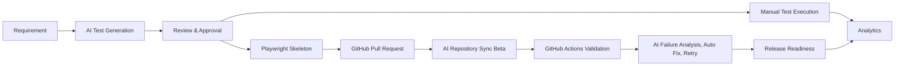

# AI QA Copilot Enterprise Documentation Portal

Welcome to the official enterprise documentation portal for **AI QA Copilot**, an AI-powered Quality Engineering Platform for QA, product, and engineering teams.

This portal documents the current implementation across the frontend and backend repositories:

- `ai-qa-copilot`: React, TypeScript, Vite, Tailwind frontend.
- `ai-qa-backend`: Express, TypeScript backend API.

> **Important**  
> This documentation is based on the current source code. Capabilities that are not implemented are explicitly marked as **Planned**, **Coming Soon**, or **Future Roadmap**.

## Audience

This handbook is written for:

- CTOs and engineering leaders evaluating enterprise quality platforms.
- QA managers and QA leads standardizing test governance.
- QA engineers using AI-assisted test design and manual execution.
- Product managers aligning requirements with test coverage.
- Client stakeholders reviewing product readiness and roadmap direction.

## Documentation Index

| Chapter | Document |
| --- | --- |
| 1 | [Product Overview](./01-Product-Overview.md) |
| 2 | [Executive Summary](./02-Executive-Summary.md) |
| 3 | [Problem Statement](./03-Problem-Statement.md) |
| 4 | [Solution Overview](./04-Solution-Overview.md) |
| 5 | [Product Vision](./05-Product-Vision.md) |
| 6 | [System Architecture](./06-System-Architecture.md) |
| 7 | [Application Workflow and User Guide](./07-Application-Workflow.md) |
| 8 | [Core Features](./08-Core-Features.md) |
| 9 | [AI Features](./09-AI-Features.md) |
| 10 | [Manual Test Execution](./10-Manual-Test-Execution.md) |
| 11 | [GitHub Integration](./11-GitHub-Integration.md) |
| 12 | [Smart Repository Analysis](./12-Smart-Repository-Analysis.md) |
| 13 | [AI Repository Sync](./13-AI-Repository-Sync.md) |
| 14 | [Analytics and Reporting](./14-Analytics-and-Reporting.md) |
| 15 | [Enterprise Features](./15-Enterprise-Features.md) |
| 16 | [Security](./16-Security.md) |
| 17 | [API Documentation](./17-API-Documentation.md) |
| 18 | [Deployment Guide](./18-Deployment-Guide.md) |
| 19 | [Product Roadmap](./19-Product-Roadmap.md) |
| 20 | [Conclusion](./20-Conclusion.md) |

## High-Level Product Flow

## v2 Validation Intelligence

AI QA Copilot v2.0 extends repository intelligence beyond impact analysis. The platform can now validate approved Playwright updates through GitHub Actions, analyze failures with AI, generate reviewable auto-fix proposals, retry validation attempts, preserve validation history, and surface release readiness signals for QA leads and engineering managers.

[Insert Screenshot: AI QA Copilot Landing Page]

## Documentation Standards

| Standard | Guidance |
| --- | --- |
| Tone | Professional, concise, and enterprise-ready. |
| Accuracy | Document only implemented capabilities unless marked as roadmap. |
| Diagrams | Use Mermaid for workflows, architecture, and sequence diagrams. |
| Screenshots | Use placeholders until screenshots are captured from a stable demo build. |
| Cross-links | Link related chapters where a workflow spans multiple modules. |
| API examples | Keep examples generic and never include real secrets. |

## Key Takeaways

- AI QA Copilot is documented as a complete QA lifecycle platform, not only a test case generator.
- The documentation connects product value, technical implementation, APIs, deployment, and roadmap.
- The portal is ready for management review, enterprise demos, client onboarding, and contributor handoff.
